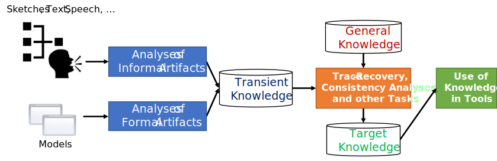

Linking Sketches and Software Architecture (LiSSA)
==================================================

.. toctree::
   :maxdepth: 2
   :caption: Contents:

The LiSSA Approach
------------------

This approach is part of the `Informal and Formal Artifacts Linker (InFormALin) <https://informalin.github.io/>`__.
It aims to connect sketches and informal diagrams (such as class diagrams, component diagrams, ..) with formal models like component models.

Overview
________

.. uml::
   :caption: The Architecture of LiSSA

    package "CLI" {
        component [CLI] as cli
    }

    package "Sketches" {
        [Model] as smodel
        [COCO] as coco

        interface model as imodel
        interface diagram as idiagram

        coco -right- idiagram
        coco -left-( imodel
        smodel -right- imodel
    }

    package "Software Architecture (SWA)" {
        [PCM] as pcm
        interface Architecture as iarch
        pcm -right- iarch
    }

    [ArDoCo] as ardoco
    interface Docs as docu
    ardoco -right- docu

    package "Linking" {
        [Linking] as linking
        interface Linker as ilink
        cli -left-( ilink

        linking -right- ilink
        linking -down-( iarch
        linking -down-( idiagram
        linking -left-( docu
    }

The Informal and Formal Artifacts Linker (InFormALin)
^^^^^^^^^^^^^^^^^^^^^^^^^^^^^^^^^^^^^^^^^^^^^^^^^^^^^

The InFormALin framework provides a set of libraries to work with informal and formal models.
All projects within InFormALin aim to connect informal and formal artifacts.
An overview for the initial processing structure of InFormALin is presented in the following figure.

    The initial InFormALin Processing Schema
